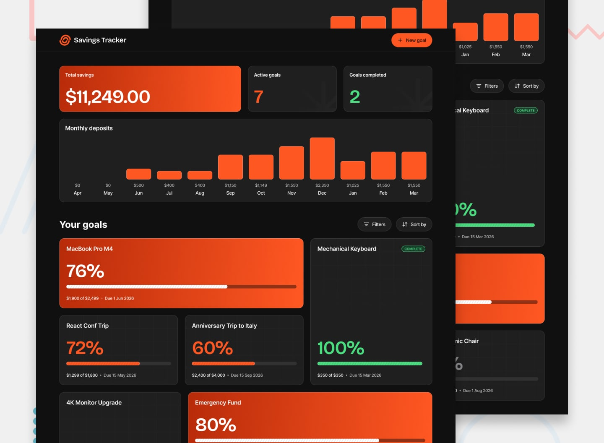

# Frontend Mentor - Savings Tracker



## Welcome! 👋

Thanks for purchasing this premium Frontend Mentor coding challenge.

[Frontend Mentor](https://www.frontendmentor.io) challenges help you improve your coding skills by building realistic projects. These premium challenges are perfect portfolio pieces, so please feel free to use what you create in your portfolio to show others.

**To do this challenge, you need a strong understanding of HTML, CSS, and JavaScript.**

## The challenge

Your challenge is to build out this savings tracker app and get it looking as close to the design as possible.

You can use any tools you like to help you complete the challenge. So if you've got something you'd like to practice, feel free to give it a go.

Your users should be able to:

### Goal Management

- Create a new savings goal with a name, target amount, and optional deadline
- Edit an existing goal to update its name, target amount, or deadline
- Delete a goal and see a confirmation modal before it's permanently removed
- See form validation messages if required fields are missing or invalid

### Deposits

- Add a deposit to a goal with an amount and optional note
- See an error message when trying to add a deposit of $0 or less
- View the full deposit history for a goal, showing the note, date, and amount for each deposit

### Dashboard

- View a summary showing total savings, number of active goals, and goals completed
- See a monthly deposits bar chart showing saving activity over time
- View all goals in a card grid with each goal's name, progress percentage, amount saved, target, and deadline
- See an empty state with a prompt to create a first goal when no goals exist
- See a completed state for goals that have reached their target

### Filtering & Sorting

- Filter goals by status: all goals, in progress, completed, or not started
- Sort goals by recently added, deadline, progress, amount saved, or alphabetically

### Goal Details

- View a goal's detail page showing progress percentage, remaining amount, a visual progress bar, and saved vs. target amounts
- See a different layout when a goal is 100% complete, showing a summary of total deposits and amount saved

### UI & Accessibility

- View the optimal layout for the interface depending on their device's screen size
- See hover and focus states for all interactive elements on the page
- Navigate the entire app using only their keyboard

### Bonus - Full-Stack (Optional)

- Sign up for an account with full name, email, and password
- Log in to an existing account
- Request a password reset via email
- Set a new password after receiving a reset link

### Data Model

A `data.json` file is provided with sample savings goals and deposits. Each goal object has the following structure:

```json
{
  "id": "goal-001",
  "name": "MacBook Pro M4",
  "target": 2499,
  "deadline": "2026-06-01",
  "createdAt": "2025-11-15T09:00:00.000Z",
  "deposits": [
    {
      "id": "dep-001-a",
      "amount": 500,
      "note": "Starting fund from freelance project",
      "createdAt": "2025-11-15T09:30:00.000Z"
    }
  ]
}
```

#### Goal properties

| Property | Type | Description |
| --- | --- | --- |
| `id` | string | Unique identifier for each goal |
| `name` | string | Display name for the savings goal |
| `target` | number | Target amount in dollars |
| `deadline` | string or null | Optional deadline date in `YYYY-MM-DD` format. `null` means no deadline (e.g., Emergency Fund) |
| `createdAt` | string | ISO 8601 timestamp of when the goal was created |
| `deposits` | array | Array of deposit objects |

#### Deposit properties

| Property | Type | Description |
| --- | --- | --- |
| `id` | string | Unique identifier for each deposit |
| `amount` | number | Deposit amount in dollars |
| `note` | string | Optional note — can be an empty string |
| `createdAt` | string | ISO 8601 timestamp of when the deposit was made |

### Data Persistence

Goal and deposit data should persist across browser sessions. When users create, edit, or delete goals, or add deposits, these changes should be saved and restored when they revisit the app.

For a front-end only solution, you can use `localStorage` to store the data. Alternatively, this project could be built as a full-stack application with a database and API to handle data persistence.

### Expected Behaviors

- **Progress bar**: A segmented bar showing the percentage of the target amount saved so far
- **Monthly deposits chart**: A bar chart aggregating all deposits by month across all goals
- **Goal cards**: Each card displays the goal name, progress percentage, amount saved vs. target, and deadline
- **Completed goals**: When a goal reaches 100%, display a distinct "Goal Complete" state with a summary showing total deposits count and total amount saved
- **Empty state**: When no goals exist, show a prompt encouraging the user to create their first goal

### Form Validation

- **New/Edit goal**: Goal name and target amount are required. Deadline is optional
- **Add deposit**: Amount is required and must be greater than $0

### Modal Behavior

- Close modals when clicking the overlay or pressing Escape
- Show a confirmation dialog before deleting a goal, warning that it will permanently delete all deposit history
- The edit goal modal should be pre-filled with the goal's existing values

### Accessibility

- Ensure keyboard navigation works for all interactive elements
- Manage focus appropriately when opening and closing modals
- Provide screen reader announcements for dynamic content changes (e.g., deposit added, goal created or deleted)

### A note about dates in the data

The `data.json` file contains dates anchored around **March 2026**. If you're starting this challenge later, we recommend shifting all dates forward so the data feels current. A month-based offset works best here because many deposits fall on the 1st of each month (e.g., "Monthly savings"), and a day-based offset would break that natural cadence.

**How to calculate the offset:**

1. The most recent activity in the data is **March 2026**
2. Calculate the difference in months between March 2026 and the current month
3. Shift all dates by that number of months — deposit `createdAt` timestamps, goal `createdAt` timestamps, and goal `deadline` dates
4. Skip `null` deadlines (e.g., the Emergency Fund has no deadline)

This preserves all the meaningful patterns — monthly deposit cadence, deadline proximity, progress history — while keeping the data feeling fresh. Any new deposits or goals a user creates will naturally use the current date, which will align with the shifted seed data.

### Want some support on the challenge?

[Join our community](https://www.frontendmentor.io/community) and ask questions in the **#help** channel.

## Where to find everything

Your task is to build out the project to the Figma design file provided. You can download the design file on the platform. **Please be sure not to share it with anyone else.** The design download comes with a `README.md` file as well to help you get set up.

All the required assets for this project are in the `/assets` folder. The images are already exported for the correct screen size and optimized. Some are reusable at multiple screen sizes. So if you don't see an image in a specific folder, it will typically be in another folder for that page.

We also include variable font files for the required fonts for this project. You can choose to either link to Google Fonts or use the local font files to host the fonts yourself.

The design system in the design file will give you more information about the various colors, fonts, and styles used in this project. Our fonts always come from [Google Fonts](https://fonts.google.com/).

## Using AI coding assistants

We've included two files to help you if you're using AI coding assistants (like Claude, GitHub Copilot, Cursor, etc.) while working on this challenge:

- `AGENTS.md` - Contains detailed instructions for AI assistants on how to help you with this challenge. It's tailored to this challenge's difficulty level, so the AI will provide guidance appropriate to your learning stage—offering more support for beginner challenges and encouraging more independence on advanced ones.
- `CLAUDE.md` - A pointer file that directs Claude-based tools to the AGENTS.md instructions.

**How to use them:** You don't need to do anything! These files are automatically detected by most AI coding tools. The AI will read them and adjust its behavior to be a better learning partner—guiding you toward solutions rather than just giving you the answers.

**Note:** These files are designed to help you *learn*, not to do the work for you. The AI is instructed to ask questions, give hints, and explain concepts rather than writing complete solutions.

## Building your project

Feel free to use any workflow that you feel comfortable with. Below is a suggested process, but do not feel like you need to follow these steps:

1. Separate the `starter-code` from the rest of this project and rename it to something meaningful for you. Initialize the codebase as a public repository on [GitHub](https://github.com/). Creating a repo will make it easier to share your code with the community if you need help. If you're not sure how to do this, [have a read-through of this Try Git resource](https://try.github.io/). **⚠️ IMPORTANT ⚠️: There are already a couple of `.gitignore` files in this project. Please do not remove them or change the content of the files. If you create a brand new project, please use the `.gitignore` files provided in your new codebase. This is to avoid the accidental upload of the design files to GitHub. With these premium challenges, please be sure not to share the design files in your GitHub repo. Thanks!**
2. Configure your repository to publish your code to a web address. This will also be useful if you need some help during a challenge as you can share the URL for your project with your repo URL. There are a number of ways to do this, and we provide some recommendations below.
3. Look through the designs to start planning out how you'll tackle the project. This step is crucial to help you think ahead for CSS classes to create reusable styles.
4. Before adding any styles, structure your content with HTML. Writing your HTML first can help focus your attention on creating well-structured content.
5. Write out the base styles for your project, including general content styles, such as `font-family` and `font-size`.
6. Start adding styles to the top of the page and work down. Only move on to the next section once you're happy you've completed the area you're working on.

## Deploying your project

As mentioned above, there are many ways to host your project for free. Our recommended hosts are:

- [GitHub Pages](https://pages.github.com/)
- [Vercel](https://vercel.com/)
- [Netlify](https://www.netlify.com/)

You can host your site using one of these solutions or any of our other trusted providers. [Read more about our recommended and trusted hosts](https://www.frontendmentor.io/guides/hosting-your-solution).

## Create a custom `README.md`

We strongly recommend overwriting this `README.md` with a custom one. We've provided a template inside the [`README-template.md`](./README-template.md) file in this starter code.

The template provides a guide for what to add. A custom `README` will help you explain your project and reflect on your learnings. Please feel free to edit our template as much as you like.

Once you've added your information to the template, delete this file and rename the `README-template.md` file to `README.md`. That will make it show up as your repository's README file.

## Submitting your solution

Submit your solution on the platform for the rest of the community to see. Follow our ["Complete guide to submitting solutions"](https://www.frontendmentor.io/guides/how-to-submit-solutions) for tips on how to do this.

Remember, if you're looking for feedback on your solution, be sure to ask questions when submitting it. The more specific and detailed you are with your questions, the higher the chance you'll get valuable feedback from the community.

**⚠️ IMPORTANT ⚠️: With these premium challenges, please be sure not to upload the design files to GitHub when you're submitting to the platform and sharing it around. If you've created a brand new project, the easiest way to do that is to copy across the `.gitignore` provided in this starter project.**

## Sharing your solution

There are multiple places you can share your solution:

1. Share your solution page in the **#finished-projects** channel of our [community](https://www.frontendmentor.io/community). 
2. Share on [X (formerly Twitter)](https://x.com/frontendmentor) and mention **@frontendmentor**, including the repo and live URLs in your post. We'd love to take a look at what you've built and help share it around.
3. Share your solution on [LinkedIn](https://www.linkedin.com/company/frontend-mentor/).
4. Blog about your experience building your project. Writing about your workflow, technical choices, and talking through your code is a brilliant way to reinforce what you've learned. Great platforms to write on are [dev.to](https://dev.to/), [Hashnode](https://hashnode.com/), and [CodeNewbie](https://community.codenewbie.org/).

We provide templates to help you share your solution once you've submitted it on the platform. Please do edit them and include specific questions when you're looking for feedback. 

The more specific you are with your questions the more likely it is that another member of the community will give you feedback.

## Got feedback for us?

We love receiving feedback! We're always looking to improve our challenges and our platform. So if you have anything you'd like to mention, please email hi[at]frontendmentor[dot]io.

**Have fun building!** 🚀
